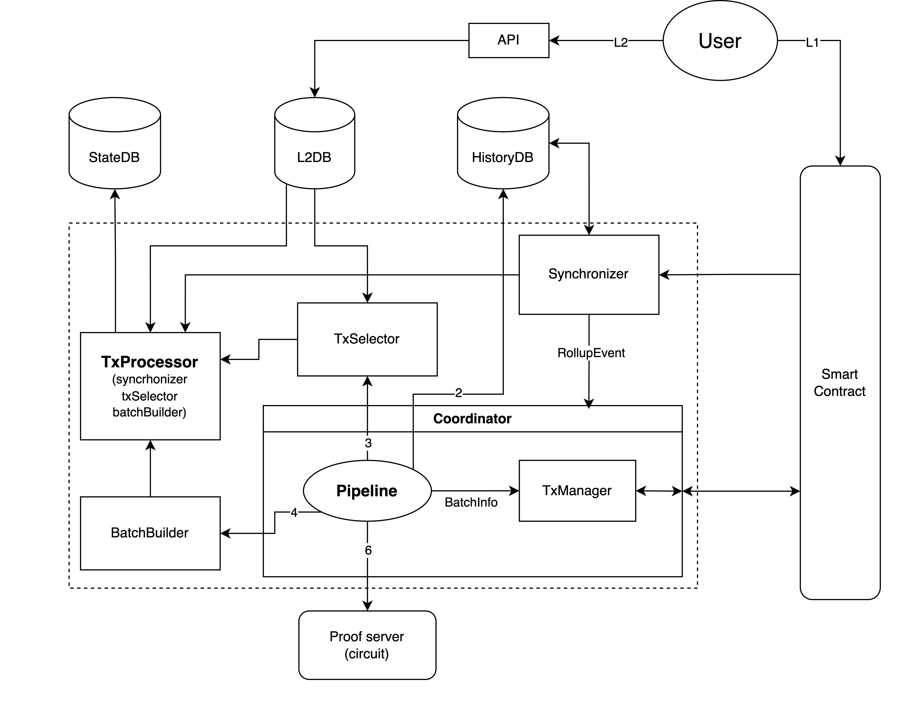

# Tokamak Sybil Resistance (SYB)
A sybil-resistant zk-rollup that scores Ethereum addresses based on a network of community vouches. Using off-chain computation and zk-proofs, the system ensures efficient, secure scoring to highlight genuine connections in decentralized networks. More information at [link](https://tokamak.notion.site/Tokamak-Sybil-Resistance-Overview-03cc941223844f30ba4473e98b1275a7)

The project consists of three components:
 
 ## Contracts
 holds the state root, verifies batch proofs from the sequencer, updates the root, and stores transaction data for availability—while queuing essential L1 transactions for timely processing in the next batch. For more info, follow the [link](./contracts/README.md)

 ## Sequencer
 keeps track of the state as a Merkle tree, batches user transactions, and efficiently updates the network. For more info, setup, and running the sequencer follow the [link](./sequencer/README.md).

 ## Circuit
 defines the logic for applying transactions and updating the state tree, producing a proof from transaction data and state roots that the contract can verify to confirm valid state transitions. For more info, follow the [link](./circuits/README.md)

 ## Architecture
 
 